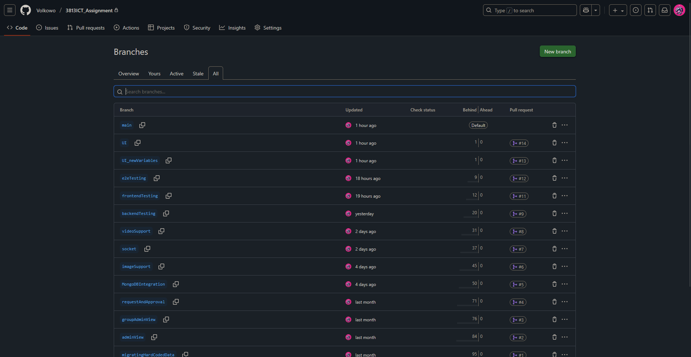

## 3813ICT_Assignment by Jason Kenaz - s5330262
---
# Phase 2's README
# Repository Organization

- `TextVideoChatSystem`: Root project folder containing both the Angular frontend and Node.js backend.
- `Assets`: Screenshots used in README.md.
- `README.md`: Documentation of project setup, architecture, and usage.

### Frontend (`TextVideoChatSystem/src`)
Handles the front-end of the website with Angular.
- `/app`: Main Angular application folder containing all components, services, and models.
- `/app/group`: Component for displaying groups; users can also leave groups from here.
- `/app/login`: Component for handling user authentication.
- `/app/models`: TypeScript interfaces for User, Group, Channel, and Message. Used in some section of the front-end's `*.ts` file.
- `/app/profile`: Component for managing groups, users, and channels depending on user roles.
- `/app/promote-modal`: Modal component (used with `profile.html`) for promoting a user to an admin role.
- `/app/register`: Component for creating a new user account.
- `/app/videos`: Component for doing a peer to peer video call (and screen sharing)
- `/app/services`: Used for peer and socket for real-time communications in `group.html` and `videos.html`.
- `/assets`: Initially was going to be the directory to store images, but I found out images are stored in back-end instead.

### Backend (`TextVideoChatSystem/server`)
Handles the back-end with Node.
- `/data`: JSON files for join requests, users, and groups. This was from Milestone 1 and is not used anymore. Storage is based on Mongo Database for this phase.
- `/images`: Any images that are used in the website is stored here. Each image will be have unique values added as suffix to prevent any duplicate pictures.
- `/initializeMongo`: Scripts to seed or reset MongoDB. This was created when I was migrating the storage from JSON to MongoDB
- `/integrationTest`: JavaScript file for testing.
- `/models`: Defines the data schema used by the server. Not used anymore since storage is done via MongoDB
- `/routes`: Defines server-side endpoints for users, groups, requests, etc.
- `/services`: Initially used to handle certain functions but was scrapped not long in the development.
- `/server.js`: Main server entry and MongoDB connection.
- `/socket.js`: Socket.IO and WebSocket setup.

## Branching Strategy
Branches are created per feature or major functionality and merged into `main` once stable.  

Phase 2 branches include:
- `mongoDBIntegration`: Migrated from JSON to MongoDB. `/initializeMongo` was made here.
- `imageSupport`: Added image upload for profile pictures and groups using `multer`.
- `socket`: Implemented real-time chat updates via Socket.IO.
- `videoSupport`: Added video call and screen sharing via PeerJS. PeerJS's server can be accessed through ELF externally.
- `backendTesting`: Back-end testing with Chai and Supertest.
- `frontendTesting`: Front-end testing with Karma.
- `e2eTesting`: End-to-end testing with Cypress.
- `UI` & `UI_newVariables`: UI updates and variable improvements for status messages, profile pictures, and server icons.

## Commit/Update Frequency <br>
Commits are consistently pushed after completing a significant progress during the development.

# Data Structures
### Client-Side
users.ts
```ts
    export class UserModel {
        constructor(
            public id: string = "",
            public email: string = "",
            public username: string = "",
            public pass: string = "",
            public avatar: string = "",
            public roles: any[] = [],
            public signedIn: boolean = false,
            public statusMessage: string = "",
            public dateJoined: string = ""
        ){}
    }

    export class LoggedInUser{
        constructor(
            public id: string = "",
            public email: string = "",
            public username: string = "",
            public avatar: string = "",
            public roles: any[] = [],
            public signedIn: boolean = false,
            public statusMessage: string = "",
            public dateJoined: string = ""
        ){}
    }
```
Represents each user in the system.
- `Roles` define the permissions for a user.
- `LoggedInUser` is a safe version for storing client-side session info without the password.
- `dateJoined` is the date when they created their account

### Server-side
MongoDB - users
```JSON
  {
    "_id": {
      "$oid": "68e88358a5a122f31b2a8492"
    },
    "id": "7",
    "email": "user7@email.com",
    "username": "userSeven",
    "pass": "123",
    "avatar": "images/pfp/defaultPFP.jpg",
    "roles": [
      "chatUser",
      "groupAdmin",
      "superAdmin"
    ],
    "signedIn": false,
    "statusMessage": "Online",
    "dateJoined": "2025-10-10T03:54:00.221Z"
  }
```

## Groups
### Front-end
groups.ts
```ts
    export class GroupModel{
        constructor(
            public groupID: string = "",
            public groupName: string = "",
            public bannedUsers: string[] = [],
            public serverPic: string = ""
        ){}
    }
```
Represents a group, which may contain multiple channels and users.
- `bannedUsers` track members that are banned by Super and Group Admin.

### Back-end
MongoDB - group
```
{
  "_id": {
    "$oid": "68e88358a5a122f31b2a84da"
  },
  "groupID": "gSep05_1007132",
  "groupName": "Burrito",
  "bannedUsers": [],
  "serverPic": ""
}
```

## Channels
### Client-side
channels.ts
```ts
export class ChannelModel{
    constructor(
        public channelID: string, 
        public channelName: string, 
        public groupID: string
    ){}
}
```
Represents a channel within a group. 
- `groupID` represents the group this channel belongs to

### Server-side
MongoDB - channel
```
{
  "_id": {
    "$oid": "68e88358a5a122f31b2a84e3"
  },
  "channelID": "c1",
  "channelName": "general",
  "groupID": "g1"
}
```

## Messages
### Client-side
messages.ts
```ts
export class MessageModel {
    constructor(
        public messageID: string,
        public userID: string,
        public groupID: string,
        public channelID: string,
        public message: string,
        public images: string[],
        public datetime: string
    ) {}
}
```
Represents a single message in a channel. 
- `userID` is used to associate the message with the sender.
- `groupID` is used to associate which group the message is from.
- `channelID` is used to associate which channel the message is from.
- `message` stores the content of the message.
- `images` stores an array of links to images that was sent.

### Server-side
MongoDB - message
```
{
  "_id": {
    "$oid": "68e88358a5a122f31b2a8494"
  },
  "messageID": "m1",
  "userID": "1",
  "groupID": "g1",
  "channelID": "c1",
  "message": "Welcome to TestGroup!",
  "images": [],
  "datetime": "2025-09-03T12:00:00.000Z"
}
```

## Join Requests
### Client-side
joinRequest.ts
```ts
export class JoinRequestModel {
    constructor(
        public requestID: string,
        public userID: string,
        public groupID: string,
        public reasonToJoin: string,
        public datetime: string
    ){}
}
```
Represents a user requesting to join a group.
- `userID` references the user
- `groupID` references the target group.
- `reasonToJoin` is an optional input where the user can explain why they want to join said group.

### Server-side
MongoDB - request
```
{
  "_id": {
    "$oid": "68e88358a5a122f31b2a84d4"
  },
  "requestID": "4",
  "userID": "7",
  "groupID": "g3",
  "reasonToJoin": "Want to share resources with the group.",
  "datetime": "2025-09-06T07:45:00.000Z"
}
```

## Membership
A bridging entity that connects user and group. This is because user and group have many-to-many relationships.
- User can be in one to many groups
- Group can have one to many users.

While MongoDB is not the same as a traditional database, I decided to add a bridging relationship just to make tracking membership easier.
### Server-side Only
MongoDB - membership
```
{
  "_id": {
    "$oid": "68e88358a5a122f31b2a8499"
  },
  "membershipID": "m1",
  "userID": "1",
  "groupID": "g1",
  "role": "superAdmin"
}
```

# Client and Server Responsibilities
## Client
The client is primarily responsible for user interaction, display, and real-time updates. It communicates with the server via REST APIs and WebSockets. Key responsibilities are:
1. **User Interface & Navigation**
- Handles rendering pages like login, register, group list, profile, chat, and video call screens.
- Uses Angular components to separate UI and logics.
2. **Data Management (Client-Side Models)**
- Maintains local state for entities such as UserModel, GroupModel, ChannelModel, MessageModel, JoinRequestModel, and Membership.
- Tracks the current logged-in user session using LoggedInUser via Local Storage.
3. **Forms & Input Validation**
- Provides input forms for registration, login, group creation, and chat messages.
- Performs basic validation (non-empty inputs and unique username) before sending data to the server.
4. **Real-Time Communication**
- Uses Socket via Socket service for real-time chat updates and to notify when a user joins/leaves a channel.
- Uses PeerJS via Peer service to handle video and screen sharing streams.
- Updates Angular component views dynamically when messages, users, or video streams change.
5. **API Communication**
- Makes HTTP requests (via Angular HttpClient) to the backend for CRUD operations on users, groups, channels, messages, and join requests.
- Handles responses from REST API, updates local state, and refreshes the UI.

## Server
The server is responsible for data persistence, validation, and real-time communication. It provides REST APIs for CRUD operations and WebSockets for instant updates. Key responsibilities:
1. **Data Persistence**
- Stores all entities (users, groups, channels, messages, join requests, membership) in MongoDB.
- Manages images uploaded by users, saving them to /images with unique suffixes added to each image.
2. **REST API**
- Exposes routes to create, read, update, and delete users, groups, channels, messages, and join requests.
- Returns JSON responses used by the Angular client.
3. **Authorization**
- Determines permissions for actions like promoting a user to admin, banning a user, or sending messages.
- Handles join requests and membership role assignments.
4. **Real-Time Communication**
- Uses Socket and Signal for instant chat updates, user join/leave notifications, and broadcasting messages to channels.
- Manages a separate video socket server (via Griffith's ELF) to handle PeerJS connections and peer ID exchange for video calls.
5. **File Serving**
- Serves static files (images) used by the frontend.

# Routes
| Route                      | Method | Parameters                             | Return                                                            | Purpose                                                |
| -------------------------- | ------ | -------------------------------------- | ----------------------------------------------------------------- | ------------------------------------------------------ |
| `/api/auth`                | POST   | `{ username, pass }`                   | Logged-in user object (without password) or `{ signedIn: false }` | Authenticate user.                                     |
| `/api/register`            | POST   | `{ username, password, email }`        | `{ register: boolean }`                                           | Register a new user.                                   |
| `/api/users`               | GET    | None                                   | `[UserModel]`                                                     | Get all users.                                         |
| `/api/user/:userID/delete` | DELETE | `userID`                               | `{ updatedUsers, updatedRequests, updatedMemberships }`           | Delete a user and related requests/memberships.        |
| `/api/update/:userID`      | POST   | `profileImage` (file), `statusMessage` | Updated user object                                               | Update a user's profile picture and/or status message. |
| `/api/groups/:userID`                                     | GET    | `userID`                           | `[GroupModel]`                                                      | Get groups the user belongs to.                                |
| `/api/groupsNotIn/:userID`                                | GET    | `userID`                           | `[GroupModel]`                                                      | Get groups the user is not in.                                 |
| `/api/groupsIn/:userID`                                   | GET    | `userID`                           | `[MembershipModel]`                                                 | Get the user's memberships.                                    |
| `/api/group/newGroup/:userID/:newGroup/:newGroup_channel` | POST   | `userID`, group name, channel name | `{ updatedUsers, updatedMembership, updatedGroup, updatedChannel }` | Create a new group with initial channel and assign membership. |
| `/api/group/:groupID/remove`                              | DELETE | `groupID`                          | `{ updatedGroup, updatedMembership, updatedChannel }`               | Delete a group and related memberships/channels.               |
| `/api/group/:groupID/add/:userID`                         | PUT    | `userID`, `groupID`                | `{ updatedMembership, updatedRequests }`                            | Add a user to a group (approving join request).                |
| `/api/group/:groupID/addChannel/:newChannel`              | PUT    | `newChannel`                       | Updated channel list                                                | Add a new channel to a group.                                  |
| `/api/group/:groupID/updateServerPic`                     | POST   | `serverPic` (file)                 | Updated group list                                                  | Update a group's server picture.                               |
| `/api/group/:groupID/:userID/leave`                       | DELETE | `groupID`, `userID`                | Updated group list                                                  | Leave a group.                                                 |
| `/api/group/:groupID/user/:userID/kick`                   | DELETE | `groupID`, `userID`                | Updated membership list                                             | Kick a user from a group.                                      |
| `/api/group/:groupID/user/:userID/ban`                    | POST   | `kickBanReason`                    | `{ updatedGroup, updatedMembership }`                               | Ban a user from a group.                                       |
| `/api/groups/:groupID/channels`                 | GET    | `groupID`              | `[ChannelModel]`     | Get all channels in a group.        |
| `/api/group/:groupID/channel/:channelID/remove` | DELETE | `groupID`, `channelID` | Updated channel list | Delete a channel from a group.      |
| `/api/channels`                                 | GET    | None                   | `[ChannelModel]`     | Get all channels (general listing). |
| `/api/groups/:groupID/channels/:channelID`    | GET    | `groupID`, `channelID`                                       | `[MessageModel]`                      | Get all messages in a channel.                      |
| `/api/addMessage/:userID/:channelID/:groupID` | POST   | `userID`, `channelID`, `groupID`, `messageContent`, `images` | `{ updatedMessages, currentMessage }` | Send a message in a channel (with optional images). |
| `/api/request/join/:groupID/:userID`                    | POST   | `groupID`, `userID`, `reasonToJoin`                         | Updated requests list                   | User requests to join a group.    |
| `/api/request/join/:groupID/:userID/:requestID/:action` | PUT    | `groupID`, `userID`, `requestID`, `action` (approve/reject) | `{ updatedMembership, updatedRequest }` | Approve or reject a join request. |
| `/api/user/:userID/group/:groupID/role` | PUT    | `userID`, `groupID`, `{ role }` | `{ updatedUsers, updatedMembership }` | Promote a user to group admin. |
| `/api/user/:userID/superAdminPromotion` | PUT    | `userID`                        | `{ updatedUser, updatedMembership }`  | Promote a user to super admin. |
| `/api/membership`                       | GET    | None                            | `[MembershipModel]`                   | Get all membership records.    |

# Angular Architecture
## Components
Each component have:
- HTML template: Defines the view in the website.
- `.spec.ts`: Used for front-end testing
- TS class: Handles logic, data fetching, and event handling.
- CSS: Used for styling.

Currently I have these components:
- `group`: Displays the group and channel the user is in. Each channel will also display messages in it.
- `login`: Handles user authentication form and log them in.
- `profile`: Displays user profile, group info, join requests, channels, and handles group management actions.
- `promote-modal`: A modal used together with `group`. This modal is used to promote a user into an Admin.
- `register`: Handles user registration form and sends data to related back-end routes.
- `videos`: Handles peer to peer video call and screen sharing.

## Models
Models represent the structure of data for both front-end and backend.
- `users.ts`: Represents a user.
- `messages.ts`: Represents a single message in a channel.
- `joinRequest.ts`: Represents a request to join a group.
- `groups.ts`: Represents a group with channels, members, and list of banned users.
- `channels.ts`: Represents a chat channel in a group.
- `bannedUsers.ts`: Represents a user that is banned from a group.

## Services
Angular services provide shared logic and backend communication.
- `socket.ts`: Manages Socket connections for real-time chat, user presence, and video peer coordination.
- `peer.ts`: Provides PeerJS integration for video and screen sharing streams.
- `data.ts`: Unused.

## Routes
There are 5 routes in total that defines the navigation path of the website. These routes are in `app.routes.ts`.
- `""`: Used to navigate to `login`-related component
- `"/login"`: Also used to navigate to `login`-related component
- `"/group"`: Used to navigate to `group`-related components
- `"/profile"`: Used to navigate to `profile`-related components
- `"/register"`: Used to navigate to `register`-related components
- `"/videos"`: Used to navigate to `videos`-related components

# Client–Server Interaction Details
## 1. User Authentication and Session

**Client:**
- The Login component sends a `POST /api/auth` request with username and password.
- If authentication succeeds, the server returns a user object with no password.
- The response is stored in the browser’s Local Storage as `LoggedInUser`.

**Server:**
- `/routes/authRoute.js` verifies the user from the MongoDB `users` collection.
- The user’s `signedIn` property in MongoDB is set to `true`.

**UI Update:**
- Angular routes navigate to `/group` after login.
- The `group` component loads the groups the user belongs to by calling `GET /api/groups/:userID`.


## 2. Group and Channel Management
**Client:**
- Profile component manages group creation, deletion, and user membership. These functionalities depend on whether a user is an admin or not.
- Creating a group sends a `POST /api/group/newGroup/:userID/:newGroup/:newGroup_channel`.
- Adding/removing channels uses `PUT /api/group/:groupID/addChannel/:newChannel` or `DELETE /api/group/:groupID/channel/:channelID/remove`.

**Server:**
- `/routes/groupRoute.js` updates MongoDB collections (`groups`, `channels`, `memberships`) accordingly.
- Temporary server-side variables log or track changes during execution.

**UI Update:**
- The Angular component refreshes groups and channels.
- Admin panels update automatically.


## 3. Real-Time Chat Messaging
**Client:**
- The Group component initializes a socket connection using the `Socket` service.
- Joining a channel emits `joinChannel` with `{ userID, channelID }`.
- Leaving a channel emits `leaveChannel` with `{ userID, channelID }`.
- Sending a message emits `message` via socket and also calls `POST /api/addMessage/:userID/:channelID/:groupID`.

**Server:**
- `socket.js` tracks connected users and channels.
- Incoming messages are stored in MongoDB (`messages`) and broadcast to all connected users in that channel.

**UI Update:**
- The `Socket` service listens for `"message"` events.
- Messages are appended to `messages` via `signal<ChatMessage[]>`.
- The chat view updates reactively without page reload.


## 4. Image Uploads and Profile Updates
**Client:**
- Uploading a profile picture or changing status calls `POST /api/update/:userID`. This route will update profile picture and status calls dynamically.
  - What this means is that it will only update the field that has values in it.
- Updating a group icon calls `POST /api/group/:groupID/updateServerPic`.

**Server:**
- Uses `multer` to save files in `/server/images` with unique suffixes added to the image(s).
- Updates MongoDB documents’ `avatar` or `serverPic` fields.

**UI Update:**
- Returned URLs update `` sources dynamically.
- Changes appear immediately in `profile` or group components.


## 5. Join Requests and Role Management
**Client:**
- Users request to join groups via `POST /api/request/join/:groupID/:userID`.
- Admins approve/reject requests via `PUT /api/request/join/:groupID/:userID/:requestID/:action`.
- Promoting users to admin or super admin uses `PUT /api/user/:userID/group/:groupID/role` or `/api/user/:userID/superAdminPromotion`.

**Server:**
- Updates MongoDB collections: `requests`, `users`, `memberships`.
- Any join requests that are approved will insert user to membership records and remove the request(s). 
  - If the request is rejected, then the user will not be inserted into membership records. The request will still be removed.
- Promotions update `roles` arrays in `users` MongoDB collection.

**UI Update:**
- Angular refetches updated users and requests.
- Admin-only features appear dynamically with `@if`.

## 6. Video and Screen Sharing (PeerJS + ELF)

**Client:**
- The **Videos** component uses the `Peer` service to connect to ELF (`https://s5330262.elf.ict.griffith.edu.au:3002`).
- Sends peer ID via `Socket` service for synchronization.
- PeerJS establishes direct P2P streams for video and screen sharing.

**Server (ELF):**
- Runs independently of the local project.
- Uses HTTPS and `PeerServer`.
- Receives and broadcasts Peer IDs for connection coordination.

**UI Update:**
- `videos.html` subscribes to the `getPeerID()` Observable.
- Incoming streams are added to the `videos` array.
- `<video>` elements update dynamically with new streams.

## Socket Communication
| Event          | Direction       | Data                           | Purpose                                                                                             |
| -------------- | --------------- | ---------------------------------------- | --------------------------------------------------------------------------------------------------- |
| `message`      | Client → Server | `{ message: string, channelID: string }` | Sends a chat message to a channel. Server stores it in DB and broadcasts it to the channel.         |
| `message`      | Server → Client | `ChatMessage` object                     | Broadcasts a chat message to all users in a channel.                                                |
| `image`        | Client → Server | `any` (image data / URL)                 | Sends image(s) to server.                                                                           |
| `image`        | Server → Client | `any` (image data / URL)                 | Broadcasts images to all connected clients.                                                         |
| `joinChannel`  | Client → Server | `{ channelID: string, userID: string }`  | Notify server that a user joins a channel; server adds socket to room.                              |
| `joinChannel`  | Server → Client | `{ userID: string, username: string }`   | Broadcasts that a user joined the channel; client updates `usersInChannel` and adds system message. |
| `leaveChannel` | Client → Server | `{ channelID: string, userID: string }`  | Notify server that a user leaves a channel; server removes socket from room.                        |
| `leaveChannel` | Server → Client | `{ userID: string, username: string }`   | Broadcasts that a user left the channel; client updates `usersInChannel` and adds system message.   |                                                          |
| `peerID`       | Client → Server | `string` (peer ID)                       | Sends PeerJS ID to ELF server for P2P video coordination.                                           |
| `peerID`       | Server → Client | `string` (peer ID)                       | Receives other users’ PeerJS IDs to establish video/screen sharing streams.                         |


---
# Phase 1's README
# Repository Organization
## Folder Structure
- `TextVideoChatSystem`: Root project folder containing the Angular frontend and Node.js backend.
- `README.md`: Documentation file describing the project setup, architecture, and usage.

### Frontend (`TextVideoChatSystem/src`)
Handles the front-end of the website with Angular.
- `/app`: Main Angular application folder containing all components, services, and models.
- `/app/group`: Component for displaying groups; users can also leave groups from here.
- `/app/login`: Component for handling user authentication.
- `/app/models`: TypeScript interfaces for User, Group, Channel, and Message. (Scrapped mid-way through development as it was replaced with JSON (backend) and Local Storage (frontend) for data persistence.)
- `/app/profile`: Component for managing groups, users, and channels depending on user roles.
- `/app/promote-modal`: Modal component (used with `profile.html`) for promoting a user to an admin role.
- `/app/register`: Component for creating a new user account.
- `/app/services`: Intended for shared logic and API calls, but was not used in this implementation.

### Backend (`TextVideoChatSystem/server`)
Handles the back-end with Node.
- `/data`: JSON files for join requests, users, and groups.
- `/models`: Defines the data schema used by the server.
- `/routes`: Defines server-side endpoints for users, groups, requests, etc.
- `/services`: Initially used to handle certain functions but was scrapped not long in the development.
## Branching Strategy
- `main`: Reserved for stable releases. Minor updates are occasionally pushed here, but most development happens on feature branches.
- Branches are created for each page or major functionality. It will get merged once I feel said page/functionality is working properly.

    - `Group_displayingChannelAndMessages`: Branch for the `group` component. I developed the feature to show individual group, channel, and messages in this branch.
    - `migratingHardCodedData`: I was under the wrong assumption during this point of development and thought I needed Local Storage for data persistence.
    - `adminView`: Branch for the `profile` component. This branch mostly focuses on the functionalities of a Super Admin.
    - `superAdminView`: Second branch for the `profile` component. This branch mostly focuses on the functionalities of a Group Admin.
    - `requestAndApproval`: Final branch for the `profile` component. This branch focuses on what a regular user can do on said page. Some of the UI overhauls were also done in this branch.
## Commit/Update Frequency
Commits are consistently pushed after completing a significant progress during the development.

# Data Structures
## Users
### Client-Side
users.ts
```ts
    export class UserModel {
        constructor(
            public id: string = "",
            public email: string = "",
            public username: string = "",
            public pass: string = "",
            public roles: any[] = [],
            public groups: any[] = [],
            public signedIn: boolean = false
        ){}
    }

    export class LoggedInUser{
        constructor(
            public id: string = "",
            public email: string = "",
            public username: string = "",
            public roles: any[] = [],
            public groups: any[] = [],
            public signedIn: boolean = false
        ){}
    }
```
Represents each user in the system.
- `Roles` define the permissions for a user.
- `groups` tracks which groups the user is a member of and what role they have.
- Both `email` and `username` are unique.
- `LoggedInUser` is a safe version for storing client-side session info without the password.

### Server-side
users.json
```json
[
  {
    "id": "1",
    "email": "og@email.com",
    "username": "super",
    "pass": "123",
    "roles": [
      "chatUser",
      "superAdmin"
    ],
    "groups": [
      {
        "group": "g1",
        "role": "superAdmin"
      },
      {
        "group": "g2",
        "role": "superAdmin"
      },
      {
        "group": "g3",
        "role": "superAdmin"
      },
      {
        "group": "g4",
        "role": "superAdmin"
      },
      {
        "group": "g5",
        "role": "superAdmin"
      },
      {
        "group": "gSep05_1007132",
        "role": "superAdmin"
      },
      {
        "group": "gSep05_1626400",
        "role": "superAdmin"
      },
      {
        "group": "gSep05_16302713",
        "role": "superAdmin"
      },
      {
        "group": "gSep05_1846285",
        "role": "superAdmin"
      },
      {
        "group": "gSep05_2357059",
        "role": "superAdmin"
      }
    ],
    "signedIn": false
  },
  {
    "id": "2",
    "email": "user2@email.com",
    "username": "userTwo",
    "pass": "123",
    "roles": [
      "chatUser",
      "groupAdmin"
    ],
    "groups": [
      {
        "group": "g1",
        "role": "groupAdmin"
      },
      {
        "group": "g2",
        "role": "groupAdmin"
      },
      {
        "group": "gSep05_1007132",
        "role": "groupAdmin"
      }
    ],
    "signedIn": false
  }
]
```
Stored in `users.json` on the server for authentication, authorization, and group management.
## Groups
### Front-end
groups.ts
```ts
    import { ChannelModel } from './channels';
    export class GroupModel{
        constructor(
            public groupID: string = "",
            public groupName: string = "",
            public channels: ChannelModel[] = [],
            public users: string[] = []
        ){}
    }
```
Represents a group, which may contain multiple channels and users.
- `channels` store all the channels inside the group.
- `users` track the members of the group by their IDs.

### Back-end
groups.json
```json
[
  {
    "groupID": "g1",
    "groupName": "TestGroup",
    "channels": [
      {
        "channelID": "c1",
        "channelName": "general",
        "messages": [
          {
            "messageID": "m1",
            "userID": "1",
            "message": "Welcome to TestGroup!",
            "datetime": "2025-09-03T12:00:00.000Z"
          },
          {
            "messageID": "m2",
            "userID": "2",
            "message": "Hi everyone!",
            "datetime": "2025-09-03T12:01:00.000Z"
          }
        ]
      },
      {
        "channelID": "c2",
        "channelName": "random",
        "messages": [
          {
            "messageID": "m3",
            "userID": "4",
            "message": "Random thoughts here...",
            "datetime": "2025-09-03T12:05:00.000Z"
          }
        ]
      },
      {
        "channelID": "cSep04_22204219",
        "channelName": "Ragebait",
        "messages": []
      }
    ],
    "users": [
      "1",
      "2",
      "4",
      "8",
      "3",
      "5",
      "6",
      "7"
    ],
    "bannedUsers": []
  },
  {
    "groupID": "g2",
    "groupName": "FunGroup",
    "channels": [
      {
        "channelID": "c3",
        "channelName": "general",
        "messages": []
      },
      {
        "channelID": "c4",
        "channelName": "memes",
        "messages": []
      }
    ],
    "users": [
      "1",
      "2",
      "8",
      "7",
      "6",
      "5",
      "3",
      "Sep06_1903296"
    ],
    "bannedUsers": []
  },
  {
    "groupID": "g3",
    "groupName": "ProjectGroup",
    "channels": [
      {
        "channelID": "c5",
        "channelName": "projects",
        "messages": [
          {
            "messageID": "m4",
            "userID": "5",
            "message": "Working on project phase 1",
            "datetime": "2025-09-03T12:10:00.000Z"
          }
        ]
      }
    ],
    "users": [
      "1",
      "5",
      "8",
      "7"
    ],
    "bannedUsers": []
  }
]
```
## Channels
### Client-side
channels.ts
```ts
import { MessageModel } from "./messages"

export class ChannelModel{
    constructor(
        public channelID: string, 
        public channelName: string, 
        public messages: MessageModel[] = []
    ){}

    addMessage(messageID: string, userID: string, message: string){
        this.messages.push(new MessageModel(messageID, userID, message))
    }
}
```
Represents a channel filled with conversations within a group. 
- `messages` stores an array of messages. 

### Server-side
Channels are included together with group.
```json
    {
    "channelID": "c5",
    "channelName": "projects",
    "messages": [
        {
        "messageID": "m4",
        "userID": "5",
        "message": "Working on project phase 1",
        "datetime": "2025-09-03T12:10:00.000Z"
        }
    ]
    }
```
## Messages
### Client-side
messages.ts
```ts
    export class MessageModel {
        constructor(
            public messageID: string,
            public userID: string,
            public message: string,
            public datetime: Date = new Date()
        ) {}
    }
```
Represents a single message in a channel. 
- `userID` is used to associate the message with the sender.
- `message` stores the content of the message.
For the 1st phase of the assignment, all messages are hard-coded.
### Server-side
Messages are also included in `groups`
```json
    "messages": [
        {
        "messageID": "m4",
        "userID": "5",
        "message": "Working on project phase 1",
        "datetime": "2025-09-03T12:10:00.000Z"
        }
    ]
```

## Join Requests
### Client-side
joinRequest.ts
```ts
export class JoinRequestModel {
    constructor(
        public requestID: string,
        public userID: string,
        public groupID: string,
        public reasonToJoin: string,
        public datetime: Date = new Date()
    ){}
}
```
Represents a user requesting to join a group.
- `userID` references the user
- `groupID` references the target group.
- `reasonToJoin` is an optional input where the user can explain why they want to join said group.

### Server-side
joinRequest.json
```json
[
  {
    "requestID": "4",
    "userID": "7",
    "groupID": "g3",
    "reasonToJoin": "Want to share resources with the group.",
    "datetime": "2025-09-06T07:45:00.000Z"
  },
  {
    "requestID": "5",
    "userID": "8",
    "groupID": "g4",
    "reasonToJoin": "Looking for study partners.",
    "datetime": "2025-09-06T08:10:00.000Z"
  }
]
```
---

# Angular Architecture
## Components
Each component have:
- HTML template: Defines the view in the website.
- TS class: Handles logic, data fetching, and event handling.
- CSS: Used for styling.

Currently I have these components:
- `group`: Displays the group and channel the user is in. Each channel will also display messages in it.
- `login`: Handles user authentication form and log them in.
- `profile`: Displays user profile, group info, join requests, channels, and handles group management actions.
- `promote-modal`: A modal used together with `group`. This modal is used to promote a user into an Admin.
- `register`: Handles user registration form and sends data to related back-end routes.

## Models
Models represent the structure of data for both front-end and backend.
- `users.ts`: Represents a user.
- `messages.ts`: Represents a single message in a channel.
- `joinRequest.ts`: Represents a request to join a group.
- `groups.ts`: Represents a group with channels, members, and list of banned users.
- `channels.ts`: Represents a chat channel in a group.
- `bannedUsers.ts`: Represents a user that is banned from a group.

## Services
I did not use any Angular services. I called `HttpClient` directly in components to make API calls.

## Routes
There are 5 routes in total that defines the navigation path of the website. These routes are in `app.routes.ts`.
- `""`: Used to navigate to `login`-related component
- `"/login"`: Also used to navigate to `login`-related component
- `"/group"`: Used to navigate to `group`-related components
- `"/profile"`: Used to navigate to `profile`-related components
- `"/register"`: Used to navigate to `register`-related components
---
# Node Architecture
## Modules
| Module (File)    | Purpose                                 | Exports / Classes           |
| ---------------- | --------------------------------------- | --------------------------- |
| `users.ts`       | Represents users and logged-in users    | `User`, `LoggedInUser` |
| `groups.ts`      | Represents groups and their properties  | `Group`                |
| `channels.ts`    | Represents chat channels within a group | `Channel`              |
| `messages.ts`    | Represents messages in channels         | `Message`              |
| `joinRequest.ts` | Represents requests to join groups      | `JoinRequest`          |
| `bannedUsers.ts` | Represents banned users in groups       | `BannedUser`           |

## Functions
The route handlers in the `routes` folder act as the functions for the server-side. A full table of the routes are available after this section.
## Files
| File                        | Purpose                                                                 |
| --------------------------- | ----------------------------------------------------------------------- |
| `server.js` or `app.js`     | Main server entry point where Express, middleware, and routes are set up.       |
| `routes/*.js`               | Defines server-side endpoints for users, groups, requests, etc.         |
| `models/*.js`               | Defines the data schema used by the server. |
| `/data`               | Stores persistent data for testing (users, groups, messages, etc.)      |


## Global Variables
I did not use any global variables in any of the server-side file.

---
# Routes
| Route | Method | Parameters | Return | Purpose |
|-------|--------|------------|--------|---------|
| `/api/register` | POST | `{ username, password, email }` | `{ register: boolean }` | Registers a new user. The parameter is used to return an alert based on whether the user successfully registers or not. |
| `/api/users` | GET | None | `users` | Get all users |
| `/api/groups` | GET | None | `groups` | Get all groups |
| `/api/requests` | GET | None | `joinRequest` | Get all pending join requests |
| `/api/group/:groupID/add/:userID` | PUT | `groupID`, `userID` | `{ user, group }` | Add a user to a group |
| `/api/group/:groupID/addChannel/:newChannel` | PUT | `groupID`, `newChannel` | `group` | Add a new channel to a group |
| `/api/group/newGroup/:userID/:groupName/:channelName` | POST | `userID`, `groupName`, `channelName` | `{ user, group }` | Create a new group |
| `/api/user/:userID/group/:groupID/role` | PUT | `userID`, `groupID`, Body: `{ role }` | `user` | Update a user's role in a group |
| `/api/user/:userID/superAdminPromotion` | PUT | `userID` | `user` | Promote a user to superAdmin |
| `/api/group/:groupID/remove` | DELETE | `groupID` | `{ users, groups }` | Delete a group |
| `/api/group/:groupID/channel/:channelID/remove` | DELETE | `groupID`, `channelID` | `group` | Delete a channel |
| `/api/group/:groupID/user/:userID/kick` | DELETE | `groupID`, `userID` | `{ users, groups }` | Kick a user from a group |
| `/api/group/:groupID/user/:userID/ban` | POST | `groupID`, `userID`, Body: `{ kickBanReason }` | `{ users, groups }` | Ban a user from a group |
| `/api/request/join/:groupID/:userID` | POST | `groupID`, `userID`, Body: `{ reasonToJoin }` | `joinRequest` | Apply to join a group |
| `/api/request/join/:groupID/:userID/:requestID/:action` | PUT | `groupID`, `userID`, `requestID`, `action` | `{ users, groups, requests }` | Approve or reject a join request |

---
# Client-Server Interaction

| Component / Action                 | HTTP Request                                        | Server Action                                                                 | Client Update                                                                 |
|-----------------------------------|----------------------------------------------------|-------------------------------------------------------------------------------|------------------------------------------------------------------------------------------|
| **User Registration**              | POST `/api/register`                               | Creates a new user if email/username doesn't exist; updates `users.json`      | Alerts user about success/failure in registering an account. If successful. navigates to `/login`                                  |
| **Login**                | GET `/api/users`, `/api/groups`, `/api/requests`  | User authentication. Returns users, groups, and join requests data if authentication is successful                                 | Populates `usersJSON`, `groupsJSON`, `requestsJSON`    |
| **Add User to Group**              | PUT `/api/group/:groupID/add/:userID`             | Updates `groups.users`, `user.groups`, and JSON files                  | Updates `usersJSON` & `groupsJSON` and removes relevant join request.          |
| **Create New Group**               | POST `/api/group/newGroup/:userID/:groupName/:channelName` | Creates new group and initial channel, adds creator (and Super Admin) to group users, and updates JSON | Updates `groupsJSON` and `usersJSON` and updates localStorage for current user |
| **Add Channel to Group**           | PUT `/api/group/:groupID/addChannel/:channelName` | Adds a new channel to group’s `channels` array                                 | Updates `groupsJSON` and refreshes channel list                                             |
| **Delete Channel**                 | DELETE `/api/group/:groupID/channel/:channelID/remove` | Removes channel from group JSON                                                | Updates `groupsJSON`                                                                       |
| **Promote to GroupAdmin**          | PUT `/api/user/:userID/group/:groupID/role`      | Updates user’s role in the group                                              | Updates `usersJSON` and UI to reflect the change in a user's role                                 |
| **Promote to SuperAdmin**          | PUT `/api/user/:userID/superAdminPromotion`      | Adds 'superAdmin' to user roles, while also adding said user to every group.                                               | Updates `usersJSON` and table in Super Admin view to reflect user's new role as a Super Admin.                                                                       |
| **Kick User from Group**           | DELETE `/api/group/:groupID/user/:userID/kick`   | Removes user from group                                                       | Updates `usersJSON` & `groupsJSON`                                         |
| **Ban User from Group**            | POST `/api/group/:groupID/user/:userID/ban`      | Removes user from group and add them to banned list                             | Updates `usersJSON`, `groupsJSON` , and also the table that displays the list of banned users.                                        |
| **Apply to Join Group**            | POST `/api/request/join/:groupID/:userID`        | Adds join request to `requests.json`                                           | Updates `requestsJSON`; clears form fields                                               |
| **Manage Join Request (Accept/Reject)** | PUT `/api/request/join/:groupID/:userID/:requestID/:action` | Updates `groups.json`, `users.json`, `requests.json`                           | Updates `usersJSON`, `groupsJSON`, `requestsJSON`, and localStorage for logged-in user |